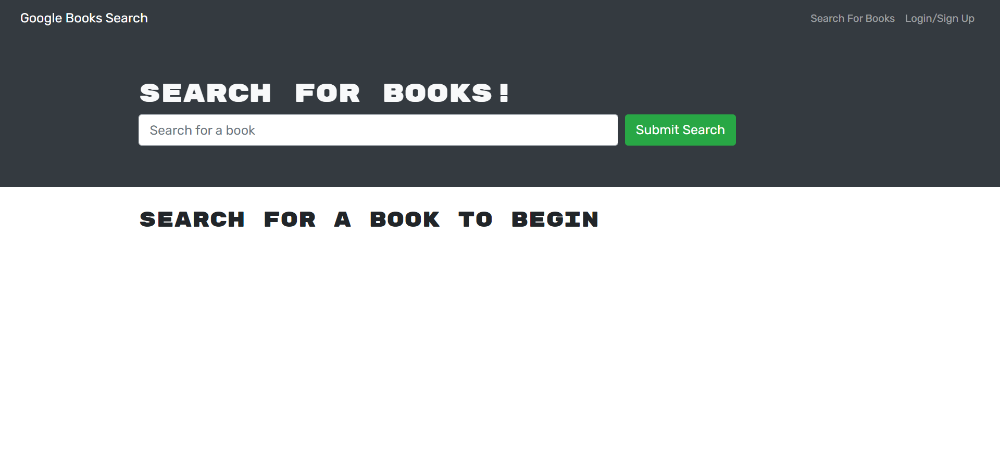
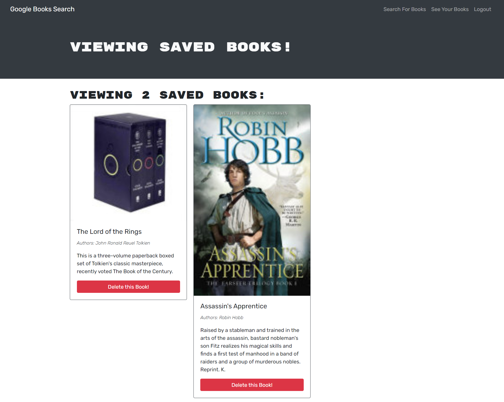

# mern-books-search 

## Summary of the project

A project to refactor a book search app setup from RESTful API to GraphQL API.

## Project Links

View deployed page [ here](https://shrouded-earth-80466.herokuapp.com/)

View Github repo [here](https://github.com/nsharma-uk/mern-book-search)

## Table of content

- [User story](#user-story)

- [Technologies](#technologies)

- [Refactoring undertaken](#refactoring-undetaken)

- [Screenshots of the application](#screenshots-of-the-application)

- [Contact me](#contact-me)

## User story

The user story must remain the same after refactoring.

### Summary

```md
AS AN avid reader
I WANT to search for new books to read
SO THAT I can keep a list of books to purchase
```

### Detailed User journey

```md
GIVEN a book search engine
WHEN I load the search engine
THEN I am presented with a menu with the options Search for Books and Login/Signup and an input field to search for books and a submit button
WHEN I click on the Search for Books menu option
THEN I am presented with an input field to search for books and a submit button
WHEN I am not logged in and enter a search term in the input field and click the submit button
THEN I am presented with several search results, each featuring a book’s title, author, description, image, and a link to that book on the Google Books site
WHEN I click on the Login/Signup menu option
THEN a modal appears on the screen with a toggle between the option to log in or sign up
WHEN the toggle is set to Signup
THEN I am presented with three inputs for a username, an email address, and a password, and a signup button
WHEN the toggle is set to Login
THEN I am presented with two inputs for an email address and a password and login button
WHEN I enter a valid email address and create a password and click on the signup button
THEN my user account is created and I am logged in to the site
WHEN I enter my account’s email address and password and click on the login button
THEN I the modal closes and I am logged in to the site
WHEN I am logged in to the site
THEN the menu options change to Search for Books, an option to see my saved books, and Logout
WHEN I am logged in and enter a search term in the input field and click the submit button
THEN I am presented with several search results, each featuring a book’s title, author, description, image, and a link to that book on the Google Books site and a button to save a book to my account
WHEN I click on the Save button on a book
THEN that book’s information is saved to my account
WHEN I click on the option to see my saved books
THEN I am presented with all of the books I have saved to my account, each featuring the book’s title, author, description, image, and a link to that book on the Google Books site and a button to remove a book from my account
WHEN I click on the Remove button on a book
THEN that book is deleted from my saved books list
WHEN I click on the Logout button
THEN I am logged out of the site and presented with a menu with the options Search for Books and Login/Signup and an input field to search for books and a submit button
```

## Technologies

Key technologies and packages used:

- Node
- Frontend:
  - Apollo client
  - React JS with react-dom,react-scripts, react-router-dom
  - Bootstrap with react-bootstrap
  - GraphQLjwt-decode
- Backend:
  - Apollo server
  - Express with apollo-server-express
  - GraphQL
  - Mongoose
  - jsonwebtoken
  - bcrypt
- Dev: nodemon

## Refactoring steps

In order to go from a RESTful setup to a GraphQL setup, the following changes took place:

- Set up an Apollo Server to use GraphQL queries and mutations to fetch and modify data, replacing the existing RESTful API.

- Modified the existing authentication middleware so that it works in the context of a GraphQL API.

- Created an Apollo Provider so that requests can communicate with an Apollo Server.

## Screenshots of the application

Desktop views

<details>
<summary>Landing page</summary>



</details>

<details>
<summary>Logged out Search page</summary>


</details>
<details>
<summary>Save books when logged in</summary>


</details>

<details>
<summary>Desktop - Saved books</summary>



</details>

## Contact me

If you have any questions about this application, please do get in touch by contacting me via [email](mailto:nsharmauk711@gmail.com).
